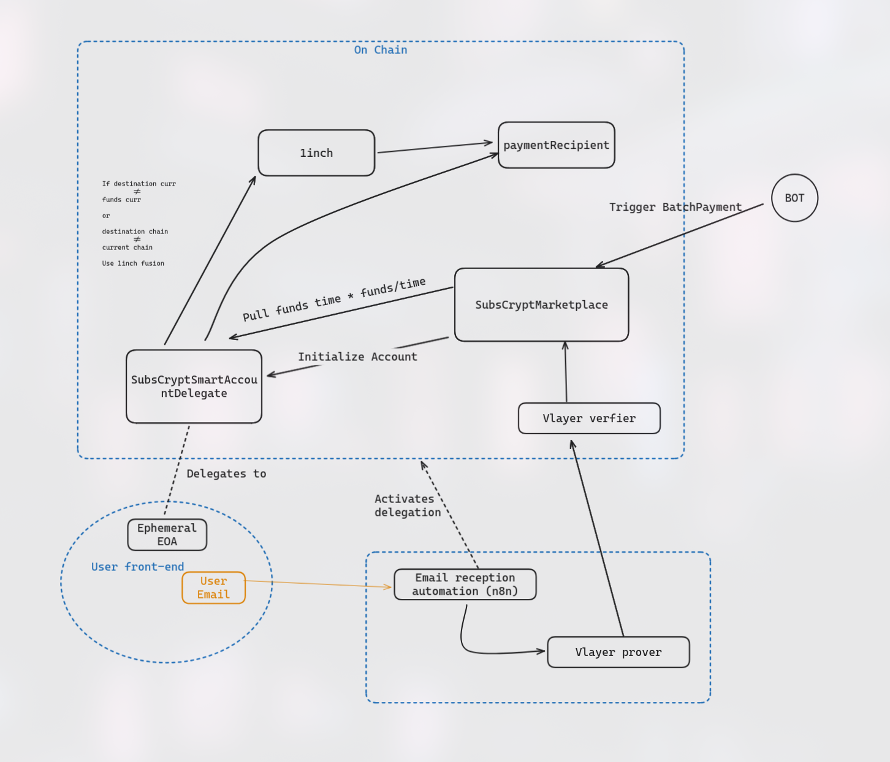

# SubsCrypt - Private On-Chain Subscription Payments
> ETH Global Prague 2025 hackathon project

## Introduction
SubsCrypt is an innovative platform that leverages EIP-7702 and Vlayer ZK-proofs to create an on-chain private subscription payment system. Name morphological analysis:
   - Subs: Short for “Subscription”, highlighting recurring payments.
   - Crypt: From the Greek “kryptós”, meaning “hidden” or “secret”, emphasizing user privacy.

In most Web2 SaaS systems, users' emails function as the service consumer profiles, allowing users to authenticate themselves in web apps and consume the specific service. In the case of paid services, payments should be routed through a conventional payment gateway (PayPal, Stripe...) that discloses customer information (email, payment information, service consumed, price paid) to a third-party application (payment gateway). The advantage is that for subscription payments, the user should only set up the payment method once, and the service provider will periodically pull the funds throw the payment gateway from the user's payment methods automatically without requiring any interaction.

### Hidden Email as a Service Consumer Identity
Using **Vlayer Email Proof**, we can authenticate a user's email off-chain within the service provider application and have it verified and bound to a specific "payment" EOA controlled by the user (service consumer) without needing to disclose any user data to third-party payment applications.

### P2P Privacy-Preserving Payments
The "payment" EOA can be created solely for the subscription payment purpose and can be funded using privacy-preserving funding systems to guarantee that the service consumer  account remains completely anonymous. To bind this "payment" EOA to the email of the user a commitment of the email (hash) is stored on chain in order to allow the consumer provider in the future to proof through his email that he is the owner of that specific "payment" EOA (Email authentication).

### Non-interactive Recursive Payments Leveraging EIP-7702
We can leverage EIP-7702 to enable non-interactive payments, meaning that only an initial signature from the "payment" EOA private key is required to set up the subscription. This signature will be used to sign the authorization tuple that is submitted on-chain by the service provider backend to delegate the smart contracts which allow the service provider to periodically pull funds from the EOA, mimicking conventional Web2 subscription systems. The signature will be sent through email to bind the "payment" EOA to a specific email address.

### Ephemeral "Payment" EOA Private Key Abstracts Key Management From User
Since once the EIP-7702 delegation is activated we can control de implementation code of the EOA programatically there is not need for the user to hold the private key of the EOA, as we can implement email authentication mechanism to allow the user to recover the funds from the address.

### Granular Payment Stream
The service provider can pull the funds whenever he wants since we implement a stream payment that accrues the paid amount per unit of time. Ideally, the service provider will periodically pull funds from the payment EOA.

### Adding Multi-currency and Multi-chain Features with 1inch Fusion+
The service provider is free to trigger a bridge and/or swap atomically when pulling funds from the EOA with built-in integration with **1inch Fusion+**.

## App flow
1. User sign in using his email to the service provider ui.
2. User clicks payment button.
3. App backend generates a random seed that represents an unique specific subscription id.
4. User generates in the frontend a "payment" EOA private key.
5. User signs the authorization tuple that setups the code of the application delegation smart contracts to the "payment" EOA.
6. User sends through email the authorization tuple through email to the service backend.
7. The service backend submits the transaction to the network with the delegation, the email proof is verified and the "payment" EOA is binded to the user email.
8. The "payment" EOA is funded with funds using privacy preserving protocols.
9. Now the service provider can pull periodically funds from the EOA according to the time that he has been serving the service.

### Vlayer Email Proof
- [Vlayer how it works](https://book.vlayer.xyz/getting-started/how-it-works.html)
- [Vlayer contract execution](https://book.vlayer.xyz/getting-started/how-it-works.html#vlayer-contract-execution)

Prover inputs:
- Email

Prover outputs:
- Hash of the email to initialize the account

Email format:
-  \_\_AUTHORIZATION\_\_\<Authorization Tuple\>\_\_AUTHORIZATION\_\_

### MPC (For the future private family subscriptions)
- [cb-mpc](https://github.com/coinbase/cb-mpc)
- [WASM Multi Party ECDSA](https://github.com/CoinFabrik/wasm-multi-party-ecdsa)

### EIP-7702 
authorization tuple: `[chain_id, address, nonce, y_parity, r, s]`

contract features: TODO

Withdraw funds using user email (Subscription will stop)
pull payment.
